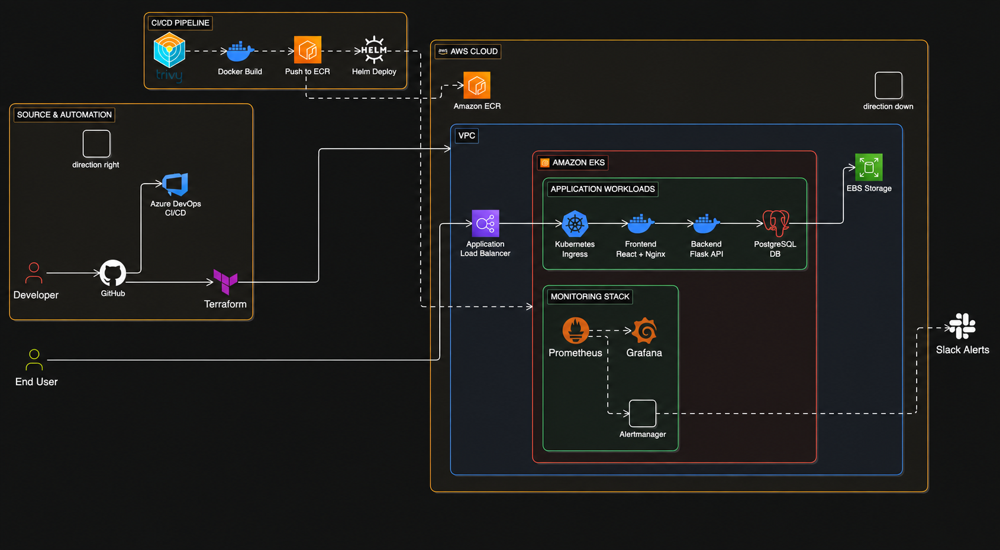

# 🚀 3-Tier DevSecOps Project on AWS EKS


A complete **3-Tier DevSecOps project** demonstrating how to build, secure, provision, deploy, validate, monitor, and alert on a cloud-native application running on **Amazon EKS**.

The project combines **Docker, Kubernetes, Helm, Terraform, Azure DevOps, Trivy, AWS, Prometheus, Grafana, Alertmanager, and Slack** into one end-to-end delivery workflow.

---

## 🏗️ Architecture



### Application Flow

```text
End User
   │
   ▼
Application Load Balancer
   │
   ▼
Kubernetes Ingress
   │
   ▼
Frontend
React + Nginx
   │
   ▼
Backend
Flask API
   │
   ▼
PostgreSQL
   │
   ▼
Amazon EBS
```

### Delivery Flow

```text
Developer
   │
   ▼
GitHub
   │
   ▼
Azure DevOps
   │
   ├── Tests
   ├── Trivy Security Scan
   ├── Docker Build
   ├── Image Security Scan
   ├── Push to Amazon ECR
   ├── Helm Deployment
   └── Post-Deployment Validation
                │
                ▼
             Amazon EKS
```

---

## 🧰 Technology Stack

| Area                   | Technologies                  |
| ---------------------- | ----------------------------- |
| Source Control         | Git, GitHub                   |
| Frontend               | React, Nginx                  |
| Backend                | Python, Flask                 |
| Database               | PostgreSQL                    |
| Containerization       | Docker, Docker Compose        |
| CI/CD                  | Azure DevOps Pipelines        |
| Security Scanning      | Trivy                         |
| Infrastructure as Code | Terraform                     |
| Cloud                  | AWS                           |
| Container Registry     | Amazon ECR                    |
| Orchestration          | Kubernetes, Amazon EKS        |
| Deployment             | Helm                          |
| Load Balancing         | AWS Application Load Balancer |
| Storage                | Amazon EBS                    |
| Monitoring             | Prometheus                    |
| Visualization          | Grafana                       |
| Alerting               | Alertmanager, Slack           |

---

## 📁 Project Structure

```text
moaaz-3tier-devsecops/
│
├── src/
│   ├── note_frontend/
│   ├── note_backend/
│   └── note_db/
│
├── tests/
│
├── k8s/
│   ├── backend/
│   ├── frontend/
│   ├── postgres/
│   ├── ingress.yaml
│   └── namespace.yaml
│
├── helm-chart/
│   ├── templates/
│   ├── Chart.yaml
│   └── values.yaml
│
├── infrastructure/
│   ├── bootstrap/
│   ├── modules/
│   │   ├── network/
│   │   ├── eks/
│   │   ├── ecr/
│   │   └── eks-addons/
│   ├── stacks/
│   ├── main.tf
│   ├── variables.tf
│   ├── outputs.tf
│   └── providers.tf
│
├── docs/
│   └── architecture.png
│
├── compose.yaml
├── azure-pipelines.yml
├── .trivyignore.yaml
├── .gitignore
└── README.md
```

---

## 🔄 Azure DevOps CI/CD Pipeline

The project uses a **7-stage Azure DevOps pipeline** to automate the complete DevSecOps lifecycle.

### Stage 1 — Application Tests

* Backend dependency installation
* Pytest execution
* Frontend dependency installation
* React production build validation

### Stage 2 — Trivy Security Scan

Trivy performs security checks before container images are created:

* Vulnerability scanning
* Secret scanning
* Infrastructure-as-Code misconfiguration scanning

### Stage 3 — Docker Build

Separate Docker images are built for:

* Frontend
* Backend

The images are stored as Azure DevOps pipeline artifacts for use in later stages.

### Stage 4 — Container Image Scan

The generated Docker images are scanned again using Trivy for **HIGH** and **CRITICAL** vulnerabilities.

### Stage 5 — Push Images to Amazon ECR

Successfully validated images are tagged and pushed to dedicated Amazon ECR repositories.

### Stage 6 — Deploy to Amazon EKS

A Rocky Linux **self-hosted Azure DevOps agent** performs the deployment using:

* AWS CLI
* kubectl
* Helm

The application is deployed to Amazon EKS using a Helm release.

### Stage 7 — Post-Deployment Validation

The final stage performs smoke tests and validates the deployed Kubernetes workloads.

```text
Tests
  ↓
Trivy Scan
  ↓
Docker Build
  ↓
Image Scan
  ↓
Amazon ECR
  ↓
Helm Deploy
  ↓
EKS Validation
```

---

## ☁️ Infrastructure as Code

AWS infrastructure is provisioned and managed using **Terraform** with a modular architecture.

### Terraform Modules

**Network**

* VPC
* Public and private subnets
* Routing
* Internet Gateway
* NAT connectivity

**EKS**

* Amazon EKS cluster
* Managed node group
* IAM integration
* Security configuration

**ECR**

* Backend image repository
* Frontend image repository
* Lifecycle policies

**EKS Add-ons**

* EKS supporting components
* IAM configuration
* AWS Load Balancer Controller integration

A dedicated Terraform bootstrap layer is also used to manage the remote backend infrastructure.

---

## ☸️ Kubernetes & Helm

The application is deployed to Kubernetes as three main workloads.

### Frontend

* React
* Nginx
* Kubernetes Deployment
* Kubernetes Service

### Backend

* Flask API
* Kubernetes Deployment
* Kubernetes Service
* ConfigMap-based configuration

### PostgreSQL

* Kubernetes StatefulSet
* Persistent storage
* Amazon EBS
* Kubernetes Service
* Headless Service
* Initialization Job

The Kubernetes resources are packaged into a reusable **Helm chart**, allowing image tags and runtime values to be injected during deployment.

---

## 🔐 DevSecOps Security

Security is integrated throughout the CI/CD workflow rather than being treated as a separate final step.

The project includes:

* Source vulnerability scanning
* Secret scanning
* IaC misconfiguration scanning
* Docker image vulnerability scanning
* HIGH and CRITICAL vulnerability gates
* IAM-based AWS access
* Secure AWS authentication from Azure DevOps
* Kubernetes Secrets for sensitive configuration

---

## 📊 Monitoring & Alerting

The EKS environment is monitored using the **Prometheus ecosystem**.

### Prometheus

Collects Kubernetes and infrastructure metrics.

### Grafana

Provides dashboards for:

* CPU utilization
* Memory utilization
* Kubernetes workloads
* Pods
* Namespaces
* Cluster resources

### Alertmanager

Processes Prometheus alerts and routes notifications.

### Slack

Alertmanager sends **firing** and **resolved** alerts directly to Slack.

```text
Kubernetes
    │
    ▼
Prometheus
   ├────────► Grafana
   │
   └────────► Alertmanager
                  │
                  ▼
                Slack
```

---

## 🐳 Local Development

The complete application can also be started locally using Docker Compose.

```bash
docker compose up -d --build
```

Check running services:

```bash
docker compose ps
```

Stop the environment:

```bash
docker compose down
```

---

## 🧹 Infrastructure Lifecycle

Because the AWS environment is managed using Terraform, the runtime infrastructure can be created and destroyed reproducibly.

```bash
terraform plan
terraform apply
terraform destroy
```

This helps keep the infrastructure version-controlled, repeatable, and easier to manage.

---

## 🎯 Key Concepts Demonstrated

* Infrastructure as Code
* CI/CD Automation
* DevSecOps
* Shift-Left Security
* Containerization
* Kubernetes Orchestration
* Helm Deployment
* Cloud Infrastructure
* Persistent Storage
* Automated Deployment Validation
* Monitoring & Observability
* Automated Alerting

---

## ✅ Project Status

* ✅ 3-Tier Application
* ✅ Docker & Docker Compose
* ✅ Kubernetes Manifests
* ✅ Helm Chart
* ✅ Terraform Infrastructure
* ✅ Amazon ECR
* ✅ Amazon EKS
* ✅ Application Load Balancer
* ✅ Azure DevOps CI/CD
* ✅ Trivy Security Scanning
* ✅ Post-Deployment Validation
* ✅ Prometheus
* ✅ Grafana
* ✅ Alertmanager
* ✅ Slack Alerts

**Project successfully completed.**

---

## 👤 Author

**Moaaz Essam**

DevOps / Cloud Engineer

`AWS` • `Linux` • `Docker` • `Kubernetes` • `Terraform` • `Azure DevOps` • `DevSecOps`
